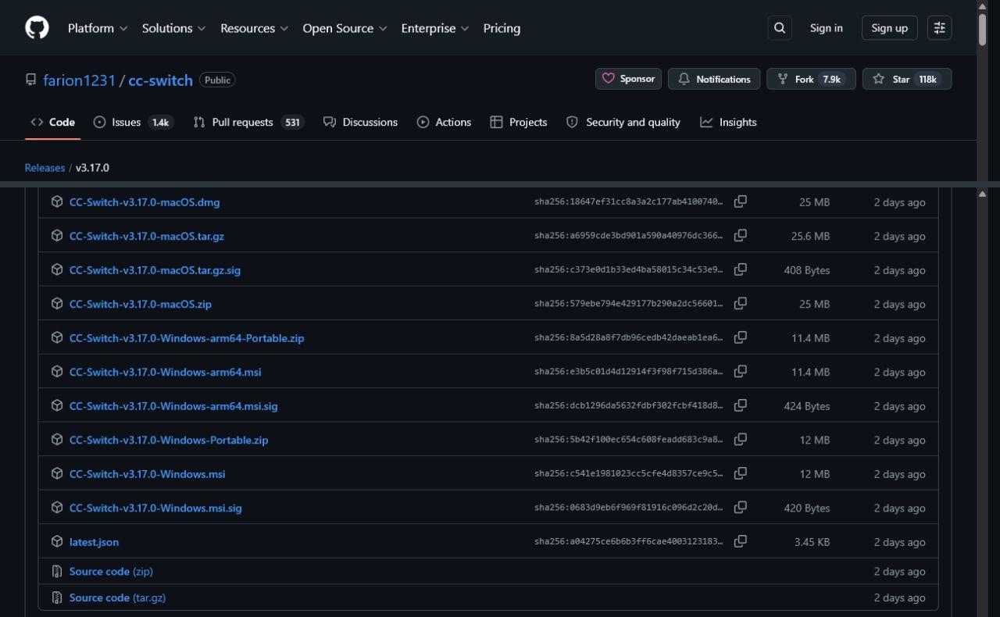
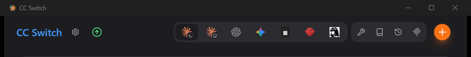
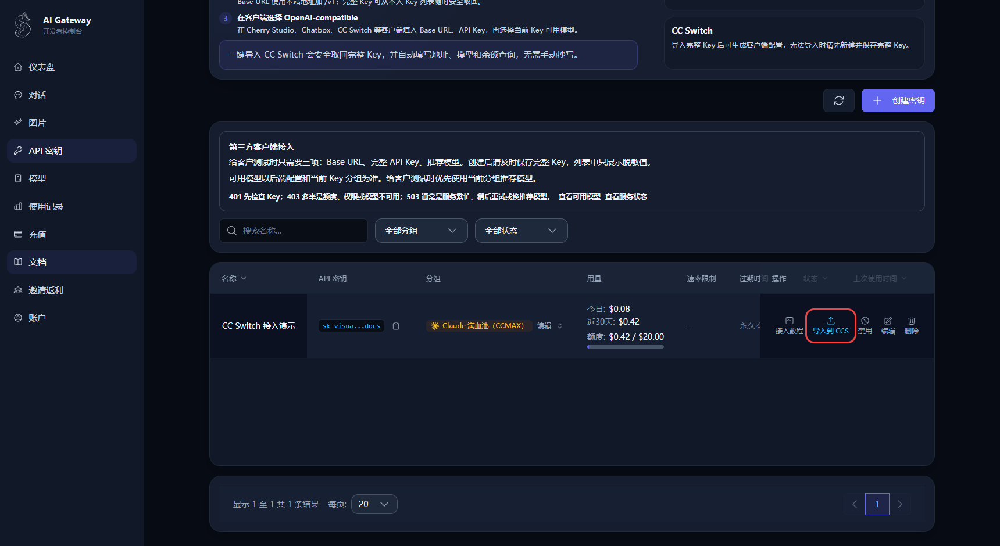
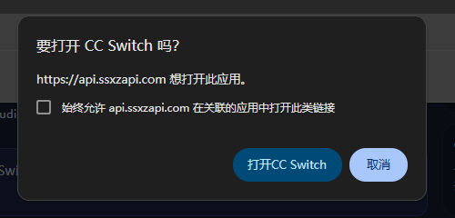
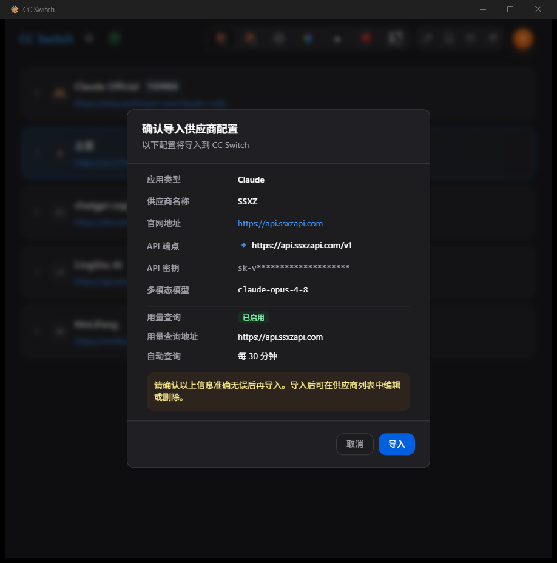
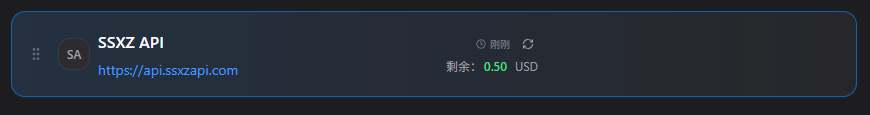
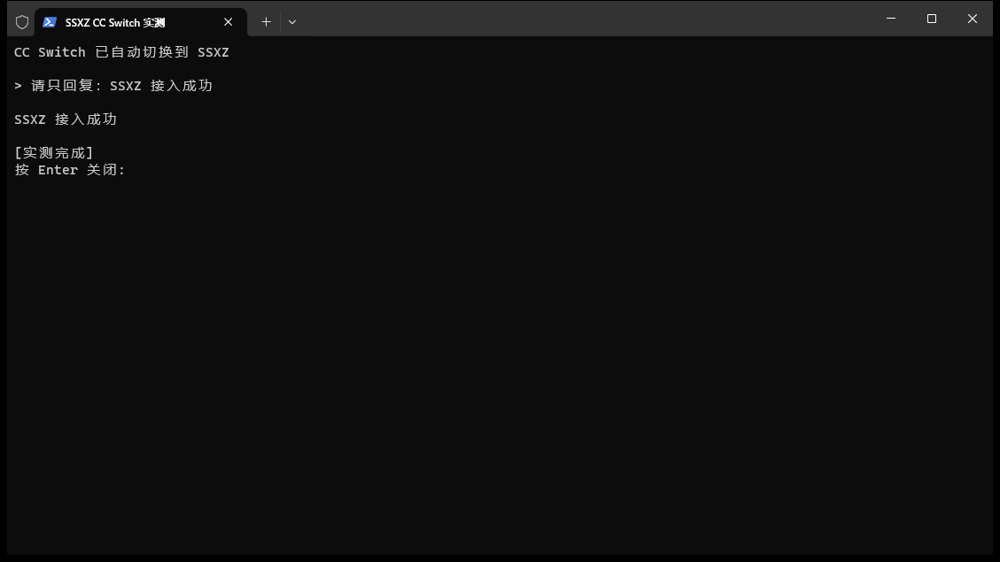

# 用 CC Switch 一键接入 SSXZ（图文教学）

> 三步，不用手填地址和密钥。

## 准备：先安装 CC Switch

已经安装过 CC Switch，可以直接跳到第 1 步。

1. 只从 [CC Switch 官方 GitHub](https://github.com/farion1231/cc-switch) 下载。
2. Windows 普通电脑选择最新版本的 `Windows.msi`；Mac 选择 `macOS.dmg`。
3. 安装后先打开一次 CC Switch，再回到浏览器继续操作。

> **注意：CC Switch 完全免费。** 网上有冒充官网的收费页面，请认准上面的 GitHub 官方地址，不要在其他网站付款。

版本号会随更新变化，认准文件名里的 `Windows.msi` 或 `macOS.dmg` 即可。

打开后看到下面这样的 CC Switch 主界面，就说明安装成功：

## 第 1 步：在 SSXZ 点“导入到 CCS”

1. 登录 SSXZ 控制台。
2. 点击左侧的 **API 密钥**。
3. 找到要使用的 Key，在这一行点击 **导入到 CCS**。

一键导入需要先有一枚 Key。如果列表还是空的，先点右上角 **创建密钥**，选好分组并创建，再回到这一行点 **导入到 CCS**。

Key 在网页里显示为脱敏值也不影响导入。SSXZ 会在你确认后安全取回这枚 Key，并把地址、完整 Key、推荐模型和余额查询配置交给 CC Switch，不需要手动复制。

## 第 2 步：确认打开并导入

浏览器弹出“要打开 CC Switch 吗？”时，点击 **打开 CC Switch**。

CC Switch 随后会显示 **确认导入供应商配置**。确认下面几项即可：

- 供应商名称是 `SSXZ`；
- API 端点是 `https://api.ssxzapi.com/v1`；
- API 密钥已经自动带入，并以星号遮住；
- 模型已经按当前 Key 的分组预填。

确认无误后点击右下角 **导入**。

## 第 3 步：切到 SSXZ，开始使用

导入完成后，SSXZ 会出现在 CC Switch 的 Claude 供应商列表。本次实测会自动切换到 SSXZ；如果你的版本没有自动切换，找到 SSXZ 后点击 **启用** 即可。

当前供应商会显示蓝色边框：

如果 Claude Code 已经打开，请先完全关闭，再重新打开。正常发送一句话并收到回复，就说明接入完成。

上图为此前受控验收中保存的真实成功记录；本教程整理时没有新增计费请求。

## 完成

以后要切换供应商，只需在 CC Switch 里点一下，不需要再修改配置文件，也不需要重新填写地址和密钥。

遇到问题时按下面顺序检查：

- 点击导入后没有反应：确认 CC Switch 已安装，并至少打开过一次；再次点击时允许浏览器打开外部应用。
- 导入后仍在使用旧供应商：在 CC Switch 中点 **启用**，然后完全关闭并重新打开 Claude Code。
- 提示 Key 不可用：回到 SSXZ 的 **API 密钥** 页面，检查 Key 是否启用、分组是否正确以及余额是否充足。
- 不要把完整 Key 发给任何人；截图时只保留脱敏值。
